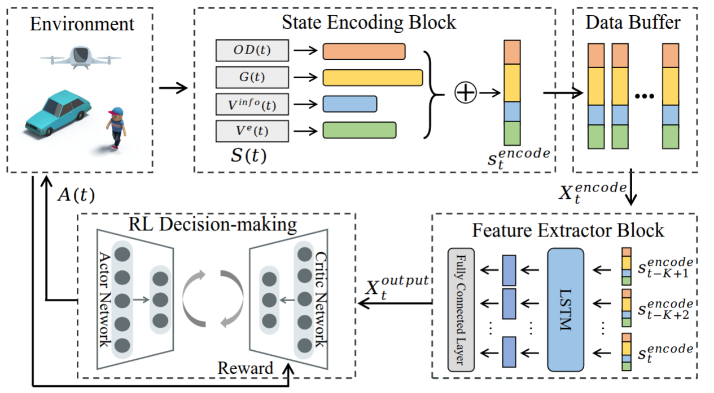

# UAGMC: Urban Air-Ground Mobility Coordination

A Deep Reinforcement Learning Framework for Coordinating Urban Air Mobility (UAM) and Ground Transportation Systems.

## 📌 Overview

UAGMC proposes an intelligent decision-making framework that leverages multimodal observational data and reinforcement learning to optimize vertiport selection in on-demand air-taxi services. The framework addresses complex, dynamic, and heterogeneous mobility environments by jointly considering passenger demands, ground traffic conditions, vertiport states, and aerial vehicle capabilities.

<div align="center">
  
</div>

## 🚀 Key Features

- **Multi-Source State Representation**: Integrates OD demands, ground speed, vertiport status, and eVTOL capabilities.
- **Temporal Feature Extraction**: Employs LSTM to capture temporal dependencies in heterogeneous state sequences.
- **PPO-based Policy Optimization**: Uses Proximal Policy Optimization for robust and stable learning.
- **Incremental Reward Design**: Tackles sparse reward problem with time-step-wise reward shaping for better training efficiency.

## 🧠 Framework Architecture

The framework consists of three major modules:

1. **State Encoding Block**: Encodes heterogeneous observational data into latent features.
2. **Feature Extractor Block**: Extracts temporal dependencies from sequential encoded states.
3. **Policy Network**: Generates actions (vertiport assignments) using PPO.


## 🚀 Usage

### 🏋️‍♂️ Training Strategies

This project provides three training strategies, each using different state representations. Below are the descriptions and usage instructions for each training script:

**Command to run:**
```python
python rl.py
```
